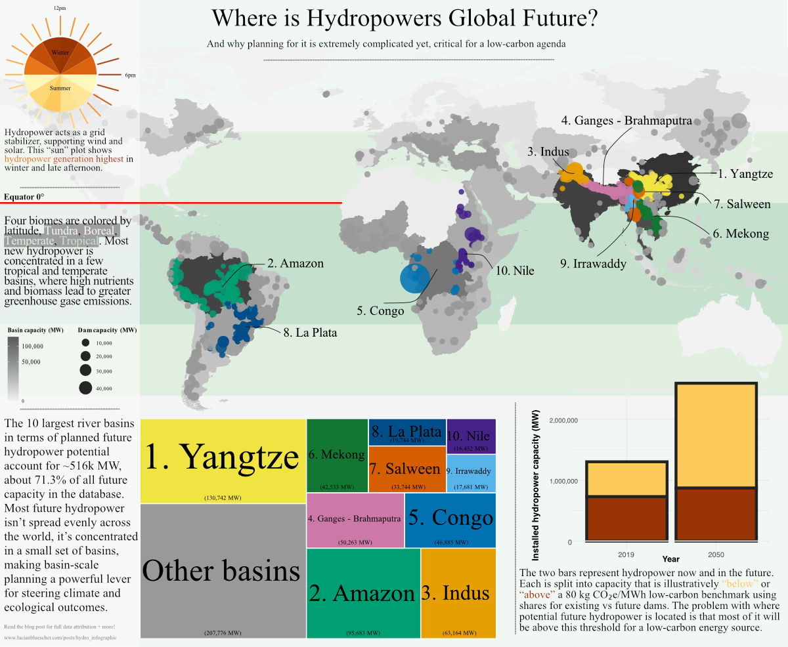

[Github Project Repository](https://lucianbluescher.com/posts/hydro_infographic/)

## Introduction

Hydropower is the world’s largest renewable electricity source, and in many grids it plays a uniquely valuable role: **it is dispatchable**. Operators can ramp generation up and down to match demand, complementing variable wind and solar. That flexibility is why many net-zero carbon emission roadmaps such as the *International Energy Authority's Net Zero Energy by 2050*, still call for substantial hydropower growth, even as solar and wind dominate renewable energy growth.

Though widely considered a renewable energy source, hydro power is not automatically “low-carbon.” Dams create reservoirs, and reservoirs can emit greenhouse gases, especially methane—when flooded organic matter decomposes under low-oxygen conditions. Those emissions vary widely across geographies and designs, which means a hydropower projects greenhouse gas emissions can look very different depending on **where** projects are built.

For this infographic project I wanted to ask the question:

-   **If hydropower must expand, where are projects concentrated, and what will the mean for hydropower planning?**

## About the Data

::: panel-tabset
### IEA NZE (scenario)

The **IEA Net Zero by 2050 (NZE)** scenario provides the long-run context for how much hydropower capacity is expected to grow by mid‑century ([IEA report page](https://www.iea.org/reports/net-zero-by-2050)). In this project, I use `data/NZE2021_AnnexA.csv` to extract **installed hydropower capacity** in 2019 and the NZE 2050 target (`Flow == "Installed total power capacity"`, `Unit == "GW"`, `Product == "Hydro"`), then convert to MW for plotting.

### FHReD (future dams)

The **Future Hydropower Reservoirs and Dams (FHReD)** database is my main source for planned hydropower projects (overview: [GlobalDamWatch FHReD](https://www.globaldamwatch.org/fhred/); associated publication: [Zarfl et al. (2015)](https://www.pnas.org/doi/10.1073/pnas.1509007112)). I work from the beta Excel file in this repo (`data/FHReD_2015_future_dams_Zarfl_et_al_beta_version/FHReD_2015_future_dams_Zarfl_et_al_beta_version.xlsx`, sheet 2), which lists proposed dams with attributes including basin identity, capacity, and coordinates. For this infographic I filter to rows with non-missing `Capacity (MW)`, `LAT_cleaned`, and `Lon_Cleaned`, and I construct a `basin` variable from `Major Basin` (falling back to `"Other basins"` when missing). I then summarize by `basin` to rank the top 10 “major basins” globally by planned MW (feeding both the palette and the treemap) and use the project coordinates as inputs to a spatial join against basin polygons for mapping.

### BasinATLAS (lev02 basins)

To move from project points to hydrologic regions, I use **BasinATLAS / HydroBASINS** polygons (see [HydroSHEDS HydroBASINS product page](https://www.hydrosheds.org/products/hydrobasins)). In this repo, the level-2 basin geometry is bundled as `data/basins_lev02_geom.rds`, which contains `hybas_id` and `MULTIPOLYGON` geometry in WGS84. I convert FHReD projects to an `sf` point layer using `LAT_cleaned` and `Lon_Cleaned`, repair basin geometries with `st_make_valid()`, and then run `st_join()` to attach each dam to the `hybas_id` that contains it. Summing `Capacity (MW)` by `hybas_id` yields a basin-level `future_mw` field that I map as a grey, square-root–scaled fill; the individual projects remain as colored points keyed to the major-basin palette.

### Li & He (biomes + CI patterns)

**Li & He (2022)** provides the carbon-intensity patterns I use as a conceptual overlay rather than as a full physical model ([paper DOI](https://doi.org/10.1016/j.rser.2022.112251)). Instead of ingesting raw reservoir time series, I hardcode published summary statistics from the supplementary tables into the script. From Table S2, I take median carbon intensities (kg CO2e/MWh) for four broad biomes—Tundra, Boreal, Temperate, Tropical—and use these to define latitudinal “biome bands” on the map as contextual background. I also use Li & He’s summary of the share of reservoirs above/below an **80 kg CO2e/MWh** low‑carbon benchmark (included in `data/share_failing_80kg.csv`) to build a simple “capacity vs threshold” panel.

Important: in that capacity panel, the **bar heights** are from the IEA NZE scenario, while the **above/below split** applies Li & He’s existing vs future reservoir shares for illustration; it is not a modeled forecast of capacity-by‑CI.

### Generational offsets (Hydropower sun)

The hydropower timing panel uses data/marginal-generation-offsets-data.dta, a Stata dataset that includes a timestamp (dt) and an hourly hydropower output signal (h). I read it with haven::read_dta(), then summarize h across months and across hours of day, and normalize those averages (divide by the maximum) so the plot shows relative timing patterns rather than absolute units. In the “sun” graphic, the inner ring encodes the average normalized hydropower level by month, and the outer “rays” encode the average normalized level by hour—so the figure highlights when hydropower tends to be higher or lower within the year and within a typical day (a regional example, not a global inventory).
:::

## Set up

First I load libraries and define a Okabe-Ito color palette and helper function for consistent basin coloring across panels. The palette is designed for high contrast and accessibility, and the helper function ensures that the same basin gets the same color in both the map and the treemap.

```{r}
#| label: setup
#| warning: false
#| message: false
#| code-fold: true
library(tidyverse)
library(here)
library(readxl)
library(scales)
library(sf)
library(ggnewscale)
library(ggrepel)
library(treemapify)
library(haven)
library(lubridate)
library(patchwork)

knitr::opts_chunk$set(dpi = 150)

# Okabe-Ito Extended: High contrast, maximum accessibility
# This is our single source of truth for basin colors across the map + treemap.
okabe_ito_11 <- c("#F0E442", # 1. Yangtze
                  "#009E73", # 2. Amazon
                  "#E69F00", # 3. Indus
                  "#CC79A7", # 4. Ganges - Brahmaputra
                  "#0072B2", # 5. Congo
                  "#117733", # 6. Mekong
                  "#D55E00", # 7. Salween
                  "#004E89", # 8. La Plata
                  "#56B4E9", # 9. Irrawady
                  "#442288", # 10. Nile
                  "#999999") # 11. Other basins (grey)

# Helper: take the 10 basin *names* (in rank order), return a named vector of colors.
# This ensures basin→color matching is stable across plots, even if data are filtered.
make_top10_basin_palette <- function(top10_basin_names) {
  if (length(top10_basin_names) != 10) {
    stop("make_top10_basin_palette() expects exactly 10 basin names.")
  }
  setNames(okabe_ito_11, c(paste0(1:10, ". ", top10_basin_names), "Other basins"))
}
```

## Top 10 Basins

Next, I read and clean the FHReD dataset, rank the top 10 basins by potential megawatts (MW), and align our color palette for consistent coloring across the map and treemap. This chunk is the data wrangling backbone for our map and treemap.

```{r}
#| label: build-shared-fhred-and-palette
#| warning: false
#| message: false
#| code-fold: true
# FHReD (Future Hydropower Reservoirs and Dams) is the pipeline dataset:
# - each row is a proposed future hydropower project
# - we use this chunk to (1) read it, (2) clean key fields, (3) rank basins by total planned MW,
#   and (4) build a named palette so the same basin has the same color everywhere.
xl_path <- here("posts/hydro_infographic/data/FHReD_2015_future_dams_Zarfl_et_al_beta_version/FHReD_2015_future_dams_Zarfl_et_al_beta_version.xlsx")
future <- read_xlsx(xl_path, sheet = 2)

future_geo <- future %>%
  # Only keep projects with the fields needed for mapping and aggregation
  filter(!is.na(`Capacity (MW)`), !is.na(LAT_cleaned), !is.na(Lon_Cleaned)) %>%
  mutate(
    # Basin name drives: top-10 ranking, labels, and color mapping
    basin = coalesce(`Major Basin`, "Other basins"),
    # FHReD contains a common spelling variant; standardize once so everything downstream matches.
    basin = stringr::str_replace_all(basin, "Ganges - Bramaputra", "Ganges - Brahmaputra")
  )

# Rank “major basins” by total planned capacity (MW).
# This is the ordering used for the top-10 labels and for basin colors.
basin_mw <- future_geo %>%
  group_by(basin) %>%
  summarise(basin_mw_total = sum(`Capacity (MW)`, na.rm = TRUE), .groups = "drop") %>%
  arrange(desc(basin_mw_total)) %>%
  mutate(rank = row_number())

# Top 10 basins by planned MW.
top_basins <- basin_mw %>% slice_head(n = 10) %>% pull(basin)

# Named color mapping used by all basin-colored layers (points on map + tiles in treemap).
basin_palette <- make_top10_basin_palette(top_basins)

future_geo <- future_geo %>%
  left_join(basin_mw, by = "basin") %>%
  mutate(
    # Create the ranked basin labels (e.g., “1. Yangtze”) used in both map + treemap.
    basin_ranked = if_else(
      basin %in% top_basins,
      paste0(match(basin, top_basins), ". ", basin),
      "Other basins"
    ),
    # Force a stable factor order so colors/labels don’t change between plots.
    basin_ranked = factor(basin_ranked, levels = names(basin_palette))
  )
```

## World Map

This map layers three different ideas on one geography. The background bands show broad **biome zones** (Li & He), basin polygons show **where total planned MW accumulates** (FHReD aggregated to BasinATLAS), and points show the locations and sizes of individual proposed dams. Together, it supports the thesis that future hydropower growth is concentrated in a handful of basins and latitudes where carbon-intensity risks may be higher.

```{r}
#| label: fig-map17
#| fig-width: 11
#| fig-height: 6
#| fig-cap: "Future hydropower on one map: biome bands (Li & He), basin polygons shaded by total future capacity (MW; FHReD aggregated to BasinATLAS lev02), and future dam projects as points colored by top-10 major basins."
#| fig-alt: "This world map shows the concentration of high MW hydropower projects in a few major basins, mostly in tropical and temperate latitudes."
#| warning: false
#| message: false
#| code-fold: true
# Li & He (2022) Table S2: median CI by biome (used as contextual background bands).
biome_ci <- tribble(
  ~biome,     ~ci_median,
  "Tundra",      43.8,
  "Boreal",     104.4,
  "Temperate",   54.8,
  "Tropical",    91.0
)

# Helper to assign a simple biome label from latitude (a coarse approximation used only for bands).
assign_biome <- function(lat) {
  case_when(
    lat >= 60 | lat <= -60 ~ "Tundra",
    (lat >= 50 & lat < 60) | (lat <= -50 & lat > -60) ~ "Boreal",
    (lat >= 23 & lat < 50) | (lat <= -23 & lat > -50) ~ "Temperate",
    lat > -23 & lat < 23 ~ "Tropical",
    TRUE ~ NA_character_
  )
}

# Attach biome labels to FHReD points so we can summarize and label consistently.
future_geo_map <- future_geo %>%
  mutate(biome = assign_biome(LAT_cleaned)) %>%
  left_join(biome_ci, by = "biome")

# Latitude-band rectangles for biome zones (background layer).
lat_bands <- tribble(
  ~ymin, ~ymax, ~biome,
  -90,   -60,   "Tundra",
  -60,   -50,   "Boreal",
  -50,   -23,   "Temperate",
  -23,    23,   "Tropical",
   23,    50,   "Temperate",
   50,    60,   "Boreal",
   60,    90,   "Tundra"
) %>%
  left_join(biome_ci, by = "biome")

# Biome band colors (background). These are separate from the basin palette.
pal_ci <- c(
  "Tundra"    = "#D8E9D9",
  "Boreal"    = "#E0E0E0",
  "Temperate" = "#A8D1AA", 
  "Tropical"  = "#58A86F" 
)

# Basin polygons (BasinATLAS lev02). These are used to spatially aggregate FHReD points.
basins_lev02 <- readRDS(here("posts/hydro_infographic/data/basins_lev02_geom.rds"))
basins_lev02 <- sf::st_as_sf(basins_lev02)
if (is.na(sf::st_crs(basins_lev02))) sf::st_crs(basins_lev02) <- 4326

# Some global basin polygons can contain invalid rings; fix geometries before spatial join.
sf::sf_use_s2(FALSE)
basins_lev02 <- sf::st_make_valid(basins_lev02)
basins_lev02 <- sf::st_collection_extract(basins_lev02, "POLYGON")
basins_lev02 <- sf::st_cast(basins_lev02, "MULTIPOLYGON", warn = FALSE)

# Convert FHReD projects to points for spatial join.
future_pts <- future_geo_map %>%
  st_as_sf(coords = c("Lon_Cleaned", "LAT_cleaned"), crs = 4326, remove = FALSE)

# Spatial join: attach BasinATLAS `hybas_id` to each FHReD project.
future_with_basin <- st_join(
  future_pts,
  basins_lev02 %>% select(hybas_id),
  left = FALSE
)
sf::sf_use_s2(TRUE)

# Aggregate planned MW (from FHReD) into BasinATLAS polygons.
basin_stats <- future_with_basin %>%
  st_drop_geometry() %>%
  group_by(hybas_id) %>%
  summarise(
    future_mw = sum(`Capacity (MW)`, na.rm = TRUE),
    .groups = "drop"
  )

basin_map <- basins_lev02 %>%
  left_join(basin_stats, by = "hybas_id") %>%
  mutate(future_mw = replace_na(future_mw, 0))

# Label anchors: take the median project coordinate per top-10 basin.
basin_labels <- future_geo_map %>%
  filter(basin %in% top_basins) %>%
  group_by(basin) %>%
  summarise(
    anchor_x = median(Lon_Cleaned, na.rm = TRUE),
    anchor_y = median(LAT_cleaned, na.rm = TRUE),
    .groups = "drop"
  ) %>%
  left_join(
    basin_mw %>%
      filter(rank <= 10) %>%
      transmute(
        basin,
        label_rank = paste0(rank, ". ", basin)
      ),
    by = "basin"
  ) %>%
  mutate(
    label = label_rank,
    nudge_x = case_when( # + for east, - for west
      basin == "Yangtze"  ~ 60,
      basin == "Mekong"   ~ 40,
      basin == "Amazon"   ~ 30,
      basin == "La Plata" ~ 25,
      basin == "Congo"    ~ -30,
      basin == "Nile"     ~ 20,
      basin == "Irrawaddy" ~ -15,
      basin == "Salween"  ~ 40,
      basin == "Indus"    ~ -10,
      basin == "Ganges - Brahmaputra"   ~ 10,
      TRUE ~ 0
    ),
    nudge_y = case_when( # + for north, - for south
      basin == "Yangtze"  ~ 10,
      basin == "Mekong"   ~ -15,
      basin == "Amazon"   ~ 10,
      basin == "La Plata" ~ -5,
      basin == "Congo"    ~ -15,
      basin == "Nile"     ~ -5,
      basin == "Irrawaddy" ~ -25,
      basin == "Salween"  ~ -5,
      basin == "Indus"    ~ 10,
      basin == "Ganges - Brahmaputra"   ~ 25,
      TRUE ~ 0
    )
  )

p_map <- ggplot() +
  geom_rect(
    data = lat_bands,
    aes(xmin = -180, xmax = 180, ymin = ymin, ymax = ymax, fill = biome),
    color = NA,
    alpha = 0.35
  ) +
  scale_fill_manual(values = pal_ci, name = "Biome") +
  ggnewscale::new_scale_fill() +
  geom_sf(
    data = basin_map,
    aes(fill = future_mw),
    color = NA,
    inherit.aes = FALSE
  ) +
  scale_fill_gradient(
    low = "grey95",
    high = "grey20",
    trans = "sqrt",
    labels = comma,
    name = "Basin capacity (MW)"
  ) +
  geom_point(
    data = future_geo_map,
    aes(
      x = Lon_Cleaned,
      y = LAT_cleaned,
      size = `Capacity (MW)`,
      color = basin_ranked
    ),
    shape = 16,
    alpha = 0.85,
    inherit.aes = FALSE
  ) +
  scale_size_continuous(range = c(1.2, 9), labels = comma, name = "Dam capacity (MW)") +
  scale_color_manual(values = basin_palette, guide = "none") +
  ggrepel::geom_text_repel(
    data = basin_labels,
    aes(x = anchor_x, y = anchor_y, label = label),
    color = "#000000",
    size = 3,
    fontface = "bold",
    family = "Times New Roman",
    lineheight = 0.9,
    seed = 123,
    nudge_x = basin_labels$nudge_x,
    nudge_y = basin_labels$nudge_y,
    box.padding = 0.5,
    point.padding = 0.5,
    segment.color = "#000000",
    segment.size = 0.4,
    segment.alpha = 0.95,
    segment.curvature = 0.2,
    segment.angle = 20,
    segment.ncp = 3,
    min.segment.length = 0,
    max.overlaps = 20,
    inherit.aes = FALSE
  ) +
  coord_sf(xlim = c(-180, 180), ylim = c(-60, 75)) +
  labs(
    # title = "Future hydropower clusters in top 10 future MW producing basins",
    # subtitle = "Basins shaded by total planned capacity (MW). Dams colored by top-10 major basins; other basins are grey.",
    x = NULL,
    y = NULL
  ) +
  theme_minimal(base_size = 9) +
  theme(
    panel.grid = element_blank(),
    axis.text = element_blank(),
    axis.ticks = element_blank(),
    plot.title = element_text(face = "bold"),
    legend.text = element_text(family = "Times New Roman"),
    legend.title = element_text(face = "bold", family = "Times New Roman")
  )

p_map

# Save for layout work (non-transparent background for the map).
ggsave(
  filename = here("images", "map_future_basins_biomes.pdf"),
  plot = p_map,
  device = cairo_pdf,
  width = 11,
  height = 6,
  units = "in",
  bg = "white"
)
```

## Treemap

This treemap collapses the FHReD pipeline into one simple message: a few basins dominate the future buildout, emphasizing more the main message of the world map. Tile area encodes planned MW, and the ranked basin labels match the map so the same basin has the same name and color across panels.

```{r}
#| label: fig-treemap14
#| fig-width: 8
#| fig-height: 5
#| fig-cap: "Future hydropower capacity by major river basin (FHReD), showing the top 10 basins plus all others aggregated."
#| fig-alt: "The top 2 basins alone, Yangtze and Amazon accout for over 1/3 of global planned hydropower energy production."
#| warning: false
#| message: false
#| code-fold: true

# Treemap (tile area = MW; colors = basin palette)
treemap_data <- future_geo %>%
  group_by(basin_ranked) %>%
  summarise(mw = sum(`Capacity (MW)`, na.rm = TRUE), .groups = "drop") %>%
  filter(mw > 0) %>%
  mutate(
    # Split labels so the basin name can scale independently of the MW line
    basin_name = as.character(basin_ranked),
    mw_label   = paste0("(", scales::comma(round(mw)), " MW)")
  )

p_treemap <- ggplot(treemap_data, aes(area = mw, fill = basin_ranked)) +
  geom_treemap(layout = "squarified", color = "white", linewidth = 0.5) +
  # Big basin name: scales to fill each rectangle
  geom_treemap_text(
    aes(label = basin_name),
    place = "centre",
    grow = TRUE,
    family = "Times New Roman",
   # fontface = "bold",
    color = "black",
    min.size = 1,
    padding.y = grid::unit(2, "mm")
  ) +
  # Small MW line: fixed size near bottom
  geom_treemap_text(
    aes(label = mw_label),
    place = "bottom",
    size = 10,
    family = "Times New Roman",
    fontface = "plain",
    color = "black",
    min.size = 1,
    padding.y = grid::unit(2, "mm")
  ) +
  scale_fill_manual(values = basin_palette, guide = "none") +
  theme_minimal(base_size = 10) +
  theme(
    legend.position = "none",
    plot.background = element_rect(fill = "transparent", color = NA),
    panel.background = element_rect(fill = "transparent", color = NA)
  )

p_treemap

# Save with transparent background for layout.
ggsave(
  filename = here("images", "treemap_future_capacity_by_basin.pdf"),
  plot = p_treemap,
  device = cairo_pdf,
  width = 8,
  height = 5,
  units = "in",
  bg = "transparent"
)
```

## “Hydropower sun”

This “sun” plot is a compact way to show that hydropower is not just “how much,” but also **when**—it has strong daily and seasonal patterns. While this panel is a regional example, it supports the story’s framing that hydropower’s value is partly its timing and dispatchability, and the trends are reasonably assumed to stay true worldwide.

```{r}
#| label: fig-sun01
#| fig-width: 6
#| fig-height: 6
#| fig-cap: "Hydropower “sun”: months at the core, hours as corona (regional example). Brighter = more generation."
#| fig-alt: "Summer months and late afternoon hours are the brightest parts of this polar plot, showing that hydropower generation is highest in those times. This illustrates that hydropower’s value is not just how much energy it produces, but also when it produces it."
#| warning: false
#| message: false
#| code-fold: true
dta <- read_dta(here::here("posts/hydro_infographic/data/marginal-generation-offsets-data.dta"))

inner_radius <- 1.5

inner_month <- dta %>%
  mutate(
    month_num = month(dt),
    month_lab = factor(month.abb[month_num], levels = month.abb)
  ) %>%
  group_by(month_lab) %>%
  summarise(h_mean = mean(h, na.rm = TRUE), .groups = "drop") %>%
  mutate(h_norm = h_mean / max(h_mean, na.rm = TRUE))

month_slots <- tibble(
  month_lab = factor(month.abb, levels = month.abb),
  x_center  = seq(1, 23, by = 2)
)

inner_month_long <- inner_month %>% inner_join(month_slots, by = "month_lab")

outer_hour <- dta %>%
  mutate(hour = hour(dt)) %>%
  group_by(hour) %>%
  summarise(h_mean = mean(h, na.rm = TRUE), .groups = "drop") %>%
  mutate(
    h_norm   = h_mean / max(h_mean, na.rm = TRUE),
    hour_rot = (hour - 12) %% 24,
    inner_r  = inner_radius + 0.1,
    outer_r  = inner_r + 0.9 * h_norm
  )

label_r <- inner_radius + 1.15
time_labels <- tibble(
  hour_rot = c(0, 6, 12, 18),
  label = c("12pm", "6pm", "12am", "6am"),
  hjust = c(0.5, -0.1, 0.5, 1.1),
  vjust = c(-0.5, 0.5, 1.2, 0.5)
)

month_labels <- tibble(
  x_center = c(1, 7, 13, 19),
  y_pos = inner_radius * 0.6,
  label = c("Jan", "Apr", "Jul", "Oct")
)

p_sun <- ggplot() +
  geom_col(
    data = inner_month_long,
    aes(x = x_center, y = inner_radius, fill = h_norm),
    width = 2, color = NA
  ) +
  geom_segment(
    data = outer_hour,
    aes(x = hour_rot, xend = hour_rot, y = inner_r, yend = outer_r, color = h_norm),
    lineend = "round", linewidth = 1.0, alpha = 0.9
  ) +
  geom_text(
    data = time_labels,
    aes(x = hour_rot, y = label_r, label = label),
    hjust = time_labels$hjust,
    vjust = time_labels$vjust,
    size = 2.8,
    color = "black",
    family = "Times New Roman"
  ) +
  geom_text(
    data = month_labels,
    aes(x = x_center, y = y_pos, label = label),
    size = 2.5,
    color = "black",
    family = "Times New Roman"
  ) +
  coord_polar(theta = "x", start = 0) +
  scale_colour_gradientn(
    colours = c("#fff7bc", "#fee391", "#fec44f", "#fe9929", "#d95f0e", "#993404"),
    name = "Avg hydropower\n(normalized)"
  ) +
  scale_fill_gradientn(
    colours = c("#fff7bc", "#fee391", "#fec44f", "#fe9929", "#d95f0e", "#993404"),
    guide = "none"
  ) +
  scale_y_continuous(limits = c(0, inner_radius + 1.3), breaks = NULL) +
  labs(
    # title = "Hydropower “sun”: months at the core, hours as rays",
    # subtitle = "12:00 at top | Brighter = more generation",
    x = NULL, y = NULL
  ) +
  theme_minimal(base_size = 11) +
  theme(
    legend.position = "right",
    axis.text = element_blank(),
    axis.ticks = element_blank(),
    panel.grid.minor = element_blank(),
    panel.grid.major = element_blank(),
    plot.title = element_text(hjust = 0.5, face = "bold"),
    plot.subtitle = element_text(hjust = 0.5, color = "gray40"),
    legend.text = element_text(family = "Times New Roman"),
    legend.title = element_text(face = "bold", family = "Times New Roman"),
    plot.background = element_rect(fill = "transparent", color = NA),
    panel.background = element_rect(fill = "transparent", color = NA)
  )

p_sun

# Save with transparent background for layout.
ggsave(
  filename = here("images", "sun_hydropower_timing.pdf"),
  plot = p_sun,
  device = cairo_pdf,
  width = 6,
  height = 6,
  units = "in",
  bg = "transparent"
)
```

## Capacity vs carbon threshold

This chart shows total global hydropower capacity in 2019 vs the NZE 2050 target (IEA NZE data), then splits each bar into capacity that is illustratively “below” vs “above” the 80 kg CO2e/MWh low‑carbon benchmark using Li & He (2022) shares for existing vs future dams. The split is the assumption: Li & He’s dam shares are applied to capacity totals for communication, not a modeled forecast.

```{r}
#| label: fig-capacity-vs-threshold
#| fig-width: 6
#| fig-height: 5
#| fig-cap: "Capacity vs carbon threshold: total installed hydropower capacity in 2019 vs the IEA NZE 2050 target, split by illustrative shares above/below an 80 kg CO2e/MWh low-carbon benchmark (Li & He, 2022)."
#| fig-alt: "Most future hydropower capacity is planned in basins and latitudes where carbon-intensity risks may be higher, this is shown as the ratio of future dams under the benchmark increases."
#| warning: false
#| message: false
#| code-fold: true

# NZE hydropower capacity in 2019 and 2050 (GW → MW)
nze <- read_csv(here("posts/hydro_infographic/data/NZE2021_AnnexA.csv"), show_col_types = FALSE)

capacity <- nze %>%
  filter(
    Product == "Hydro",
    Flow == "Installed total power capacity",
    Unit == "GW",
    Year %in% c(2019, 2050)
  ) %>%
  select(Year, Hydro_GW = Value) %>%
  mutate(Hydro_MW = Hydro_GW * 1000)

# Li & He-style shares above/below 80 kg CO2e/MWh (existing vs future dams)
shares <- read_csv(here("posts/hydro_infographic/data/share_failing_80kg.csv"), show_col_types = FALSE)

# Map NZE years → which share to use (existing vs future)
capacity_split <- capacity %>%
  mutate(group = if_else(Year == 2019, "Existing dams", "Future dams")) %>%
  left_join(shares, by = "group") %>%
  mutate(
    frac_above = pct_above_80 / 100,
    frac_below = pct_below_80 / 100,
    MW_above   = Hydro_MW * frac_above,
    MW_below   = Hydro_MW * frac_below
  ) %>%
  select(Year, MW_above, MW_below) %>%
  pivot_longer(
    cols = starts_with("MW_"),
    names_to = "segment",
    values_to = "MW"
  ) %>%
  mutate(
    segment = if_else(segment == "MW_above",
                      "Above 80 kg CO2e/MWh",
                      "Below 80 kg CO2e/MWh"),
    Year = factor(Year)
  )

# Stacked bar: total capacity, split by above/below 80 kg CO2e/MWh
p_capacity_threshold <- ggplot(capacity_split, aes(x = Year, y = MW, fill = segment)) +
  geom_col(color = "#222222") +
  scale_y_continuous(labels = scales::comma) +
  scale_fill_manual(
    values = c(
      "Below 80 kg CO2e/MWh" = "#993404",
      "Above 80 kg CO2e/MWh" = "#FFCA5C"
    ),
    name = NULL
  ) +
  labs(
    x = "Year",
    y = "Installed hydropower capacity (MW)"
  ) +
  theme_minimal(base_size = 11) +
  theme(
    axis.title = element_text(face = "bold"),
    legend.position = "none",
    plot.background = element_rect(fill = "transparent", color = NA),
    panel.background = element_rect(fill = "transparent", color = NA)
  )

p_capacity_threshold

ggsave(
  filename = here("images", "capacity_vs_threshold.pdf"),
  plot = p_capacity_threshold,
  device = cairo_pdf,
  width = 6,
  height = 5,
  units = "in",
  bg = "transparent"
)
```

## Design Choices

::: panel-tabset

### Graphic form 

I combined conventional panels (map, treemap, stacked bars) with a more experimental radial “sun” to show not just how much hydropower is planned, but where it clusters and when it tends to be available. The mix is intentional: each chart type is chosen for the specific question it answers rather than sticking to a single template.

### Text

I use titles and short captions to state the takeaway and then quickly decode the encodings (what color/size/position means) without repeating the same phrasing in the body text. Axis labels and legend text are kept minimal but explicit about units and normalization so readers can interpret scale correctly.

### Themes

Non-data elements are stripped back (light or removed gridlines, clean backgrounds) so the eye goes to the shapes and labels first. The theme choices are consistent across panels to make the set feel like one system rather than four separate plots.

### Colors

A single named, colorblind-safe categorical palette is reused for the top-10 basins so basin identity stays consistent across map and treemap. Continuous context layers stay in restrained greys so categorical basin colors and key labels carry the emphasis.

### Typography

I use a consistent serif family (Times New Roman) and size hierarchy to support a print/infographic feel and quick scanning. Label placement is tuned for legibility, with repelled map labels to reduce collisions in dense regions.

### General design

Panels are ordered to build a visual hierarchy from global context to focused interpretation, with spacing and alignment designed for “poster-distance” reading.

### Contextualizing your data

I explicitly separate what is directly observed/compiled (FHReD future projects, basin polygons) from what is scenario-based (IEA NZE capacity) and what is used illustratively (Li & He shares applied to capacity totals). Units and transformations (e.g., GW→MW, normalized timing) are stated so the viewer understands what the numbers represent.

### Centering your primary message

Every panel supports the same claim: hydropower expansion is not just a quantity problem, it’s a siting-and-conditions problem with uneven geographic concentration and potential carbon trade-offs. The design keeps attention on concentration in a few basins and the threshold framing that motivates “build better, not just more.”

### Accessibility

I use a high-contrast, colorblind-friendly palette for categorical basin identity and avoid relying on color alone when possible (labels, ordering, and structure also carry meaning). Each figure includes alt text so the encodings are legible to screen readers and to readers skimming the page.

### DEI lens 

I frame the story around choices and trade-offs rather than inevitability, to avoid implying communities and ecosystems are simply “inputs” to an energy transition. Using basins (instead of borders) foregrounds downstream, cross-border impacts and the people and habitats connected by shared rivers.
:::

## Limitations & assumptions

-   **FHReD coverage**: FHReD is the most cited future dam dataset I found, but “future dams” are inherently uncertain; the database may miss projects or include projects that do not get built.
-   **Spatial joins**: Basin assignment depends on polygon boundaries and geometry validity; any spatial join can produce edge cases near borders/coasts. I use level 2 basins from BasinATLAS, which may misclassify some hydropower projects.
-   **Biome bands**: The map’s “biomes” are implemented as latitudinal bands tied to Li & He’s biome medians; they are communication and estimation categories, not a local ecological classification for each dam site.
-   **Capacity vs threshold split (illustrative)**: The NZE capacity totals are scenario data, while the above/below 80 kg CO2e/MWh split applies Li & He’s shares (existing vs future) to those totals for communication—not a modeled forecast of capacity-by‑Carbon Intensity.
-   **Sun plot context**: The hydropower timing “sun” is a normalized output profile for a specific region/dataset; it supports the timing argument but is not a global inventory of hydro seasonality.

## Single Code Chunk

```{r}
#| label: combined-hydropower-analysis
#| code-fold: true
#| warning: false
#| message: false
#| eval: false
#| echo: true

library(tidyverse)
library(here)
library(readxl)
library(scales)
library(sf)
library(ggnewscale)
library(ggrepel)
library(treemapify)
library(haven)
library(lubridate)
library(patchwork)

knitr::opts_chunk$set(dpi = 150)

# --- 1. Setup & Color Palette ---
okabe_ito_11 <- c("#F0E442", "#009E73", "#E69F00", "#CC79A7", "#0072B2", 
                  "#117733", "#D55E00", "#004E89", "#56B4E9", "#442288", "#999999")

make_top10_basin_palette <- function(top10_basin_names) {
  if (length(top10_basin_names) != 10) {
    stop("make_top10_basin_palette() expects exactly 10 basin names.")
  }
  setNames(okabe_ito_11, c(paste0(1:10, ". ", top10_basin_names), "Other basins"))
}

# --- 2. Data Wrangling (FHReD & Basins) ---
xl_path <- here("posts/hydro_infographic/data/FHReD_2015_future_dams_Zarfl_et_al_beta_version/FHReD_2015_future_dams_Zarfl_et_al_beta_version.xlsx")
future <- read_xlsx(xl_path, sheet = 2)

future_geo <- future %>%
  filter(!is.na(`Capacity (MW)`), !is.na(LAT_cleaned), !is.na(Lon_Cleaned)) %>%
  mutate(
    basin = coalesce(`Major Basin`, "Other basins"),
    basin = stringr::str_replace_all(basin, "Ganges - Bramaputra", "Ganges - Brahmaputra")
  )

basin_mw <- future_geo %>%
  group_by(basin) %>%
  summarise(basin_mw_total = sum(`Capacity (MW)`, na.rm = TRUE), .groups = "drop") %>%
  arrange(desc(basin_mw_total)) %>%
  mutate(rank = row_number())

top_basins <- basin_mw %>% slice_head(n = 10) %>% pull(basin)
basin_palette <- make_top10_basin_palette(top_basins)

future_geo <- future_geo %>%
  left_join(basin_mw, by = "basin") %>%
  mutate(
    basin_ranked = if_else(
      basin %in% top_basins,
      paste0(match(basin, top_basins), ". ", basin),
      "Other basins"
    ),
    basin_ranked = factor(basin_ranked, levels = names(basin_palette))
  )

# --- 3. World Map Visualization ---
biome_ci <- tribble(
  ~biome,      ~ci_median,
  "Tundra",      43.8,
  "Boreal",     104.4,
  "Temperate",   54.8,
  "Tropical",    91.0
)

assign_biome <- function(lat) {
  case_when(
    lat >= 60 | lat <= -60 ~ "Tundra",
    (lat >= 50 & lat < 60) | (lat <= -50 & lat > -60) ~ "Boreal",
    (lat >= 23 & lat < 50) | (lat <= -23 & lat > -50) ~ "Temperate",
    lat > -23 & lat < 23 ~ "Tropical",
    TRUE ~ NA_character_
  )
}

future_geo_map <- future_geo %>%
  mutate(biome = assign_biome(LAT_cleaned)) %>%
  left_join(biome_ci, by = "biome")

lat_bands <- tribble(
  ~ymin, ~ymax, ~biome,
  -90,   -60,   "Tundra",
  -60,   -50,   "Boreal",
  -50,   -23,   "Temperate",
  -23,    23,   "Tropical",
   23,    50,   "Temperate",
   50,    60,   "Boreal",
   60,    90,   "Tundra"
) %>%
  left_join(biome_ci, by = "biome")

pal_ci <- c("Tundra" = "#D8E9D9", "Boreal" = "#E0E0E0", "Temperate" = "#A8D1AA", "Tropical" = "#58A86F")

basins_lev02 <- readRDS(here("posts/hydro_infographic/data/basins_lev02_geom.rds")) %>%
  sf::st_as_sf()
if (is.na(sf::st_crs(basins_lev02))) sf::st_crs(basins_lev02) <- 4326

sf::sf_use_s2(FALSE)
basins_lev02 <- sf::st_make_valid(basins_lev02) %>%
  sf::st_collection_extract("POLYGON") %>%
  sf::st_cast("MULTIPOLYGON", warn = FALSE)

future_pts <- future_geo_map %>%
  st_as_sf(coords = c("Lon_Cleaned", "LAT_cleaned"), crs = 4326, remove = FALSE)

future_with_basin <- st_join(future_pts, basins_lev02 %>% select(hybas_id), left = FALSE)
sf::sf_use_s2(TRUE)

basin_stats <- future_with_basin %>%
  st_drop_geometry() %>%
  group_by(hybas_id) %>%
  summarise(future_mw = sum(`Capacity (MW)`, na.rm = TRUE), .groups = "drop")

basin_map <- basins_lev02 %>%
  left_join(basin_stats, by = "hybas_id") %>%
  mutate(future_mw = replace_na(future_mw, 0))

basin_labels <- future_geo_map %>%
  filter(basin %in% top_basins) %>%
  group_by(basin) %>%
  summarise(anchor_x = median(Lon_Cleaned, na.rm = TRUE), anchor_y = median(LAT_cleaned, na.rm = TRUE), .groups = "drop") %>%
  left_join(basin_mw %>% filter(rank <= 10) %>% transmute(basin, label_rank = paste0(rank, ". ", basin)), by = "basin") %>%
  mutate(
    label = label_rank,
    nudge_x = case_when(basin == "Yangtze" ~ 60, basin == "Mekong" ~ 40, basin == "Amazon" ~ 30, basin == "La Plata" ~ 25, basin == "Congo" ~ -30, basin == "Nile" ~ 20, basin == "Irrawaddy" ~ -15, basin == "Salween" ~ 40, basin == "Indus" ~ -10, basin == "Ganges - Brahmaputra" ~ 10, TRUE ~ 0),
    nudge_y = case_when(basin == "Yangtze" ~ 10, basin == "Mekong" ~ -15, basin == "Amazon" ~ 10, basin == "La Plata" ~ -5, basin == "Congo" ~ -15, basin == "Nile" ~ -5, basin == "Irrawaddy" ~ -25, basin == "Salween" ~ -5, basin == "Indus" ~ 10, basin == "Ganges - Brahmaputra" ~ 25, TRUE ~ 0)
  )

p_map <- ggplot() +
  geom_rect(data = lat_bands, aes(xmin = -180, xmax = 180, ymin = ymin, ymax = ymax, fill = biome), color = NA, alpha = 0.35) +
  scale_fill_manual(values = pal_ci, name = "Biome") +
  ggnewscale::new_scale_fill() +
  geom_sf(data = basin_map, aes(fill = future_mw), color = NA, inherit.aes = FALSE) +
  scale_fill_gradient(low = "grey95", high = "grey20", trans = "sqrt", labels = comma, name = "Basin capacity (MW)") +
  geom_point(data = future_geo_map, aes(x = Lon_Cleaned, y = LAT_cleaned, size = `Capacity (MW)`, color = basin_ranked), shape = 16, alpha = 0.85, inherit.aes = FALSE) +
  scale_size_continuous(range = c(1.2, 9), labels = comma, name = "Dam capacity (MW)") +
  scale_color_manual(values = basin_palette, guide = "none") +
  ggrepel::geom_text_repel(data = basin_labels, aes(x = anchor_x, y = anchor_y, label = label), color = "#000000", size = 3, fontface = "bold", family = "Times New Roman", lineheight = 0.9, seed = 123, nudge_x = basin_labels$nudge_x, nudge_y = basin_labels$nudge_y, box.padding = 0.5, point.padding = 0.5, segment.color = "#000000", segment.size = 0.4, segment.alpha = 0.95, min.segment.length = 0, inherit.aes = FALSE) +
  coord_sf(xlim = c(-180, 180), ylim = c(-60, 75)) +
  theme_minimal(base_size = 9) +
  theme(panel.grid = element_blank(), axis.text = element_blank(), axis.ticks = element_blank(), legend.text = element_text(family = "Times New Roman"), legend.title = element_text(face = "bold", family = "Times New Roman"))

# --- 4. Treemap Visualization ---
treemap_data <- future_geo %>%
  group_by(basin_ranked) %>%
  summarise(mw = sum(`Capacity (MW)`, na.rm = TRUE), .groups = "drop") %>%
  filter(mw > 0) %>%
  mutate(basin_name = as.character(basin_ranked), mw_label = paste0("(", scales::comma(round(mw)), " MW)"))

p_treemap <- ggplot(treemap_data, aes(area = mw, fill = basin_ranked)) +
  geom_treemap(layout = "squarified", color = "white", linewidth = 0.5) +
  geom_treemap_text(aes(label = basin_name), place = "centre", grow = TRUE, family = "Times New Roman", color = "black", min.size = 1, padding.y = grid::unit(2, "mm")) +
  geom_treemap_text(aes(label = mw_label), place = "bottom", size = 10, family = "Times New Roman", fontface = "plain", color = "black", min.size = 1, padding.y = grid::unit(2, "mm")) +
  scale_fill_manual(values = basin_palette, guide = "none") +
  theme_minimal() + theme(legend.position = "none")

# --- 5. Hydropower Sun (Timing) ---
dta <- read_dta(here::here("posts/hydro_infographic/data/marginal-generation-offsets-data.dta"))
inner_radius <- 1.5

inner_month <- dta %>%
  mutate(month_num = month(dt), month_lab = factor(month.abb[month_num], levels = month.abb)) %>%
  group_by(month_lab) %>%
  summarise(h_mean = mean(h, na.rm = TRUE), .groups = "drop") %>%
  mutate(h_norm = h_mean / max(h_mean, na.rm = TRUE)) %>%
  inner_join(tibble(month_lab = factor(month.abb, levels = month.abb), x_center = seq(1, 23, by = 2)), by = "month_lab")

outer_hour <- dta %>%
  mutate(hour = hour(dt)) %>%
  group_by(hour) %>%
  summarise(h_mean = mean(h, na.rm = TRUE), .groups = "drop") %>%
  mutate(h_norm = h_mean / max(h_mean, na.rm = TRUE), hour_rot = (hour - 12) %% 24, inner_r = inner_radius + 0.1, outer_r = inner_r + 0.9 * h_norm)

p_sun <- ggplot() +
  geom_col(data = inner_month, aes(x = x_center, y = inner_radius, fill = h_norm), width = 2, color = NA) +
  geom_segment(data = outer_hour, aes(x = hour_rot, xend = hour_rot, y = inner_r, yend = outer_r, color = h_norm), linewidth = 1.0) +
  coord_polar(theta = "x", start = 0) +
  scale_colour_gradientn(colours = c("#fff7bc", "#993404"), name = "Avg hydro") +
  scale_fill_gradientn(colours = c("#fff7bc", "#993404"), guide = "none") +
  theme_minimal() + theme(axis.text = element_blank(), panel.grid = element_blank())

# --- 6. Capacity vs Carbon Threshold ---
nze <- read_csv(here("posts/hydro_infographic/data/NZE2021_AnnexA.csv"), show_col_types = FALSE)
shares <- read_csv(here("posts/hydro_infographic/data/share_failing_80kg.csv"), show_col_types = FALSE)

capacity_split <- nze %>%
  filter(Product == "Hydro", Flow == "Installed total power capacity", Unit == "GW", Year %in% c(2019, 2050)) %>%
  mutate(Hydro_MW = Value * 1000, group = if_else(Year == 2019, "Existing dams", "Future dams")) %>%
  left_join(shares, by = "group") %>%
  mutate(MW_above = Hydro_MW * (pct_above_80 / 100), MW_below = Hydro_MW * (pct_below_80 / 100)) %>%
  pivot_longer(cols = c(MW_above, MW_below), names_to = "segment", values_to = "MW") %>%
  mutate(segment = if_else(segment == "MW_above", "Above 80 kg CO2e/MWh", "Below 80 kg CO2e/MWh"), Year = factor(Year))

p_capacity_threshold <- ggplot(capacity_split, aes(x = Year, y = MW, fill = segment)) +
  geom_col(color = "#222222") +
  scale_fill_manual(values = c("Below 80 kg CO2e/MWh" = "#993404", "Above 80 kg CO2e/MWh" = "#FFCA5C")) +
  theme_minimal()
```
