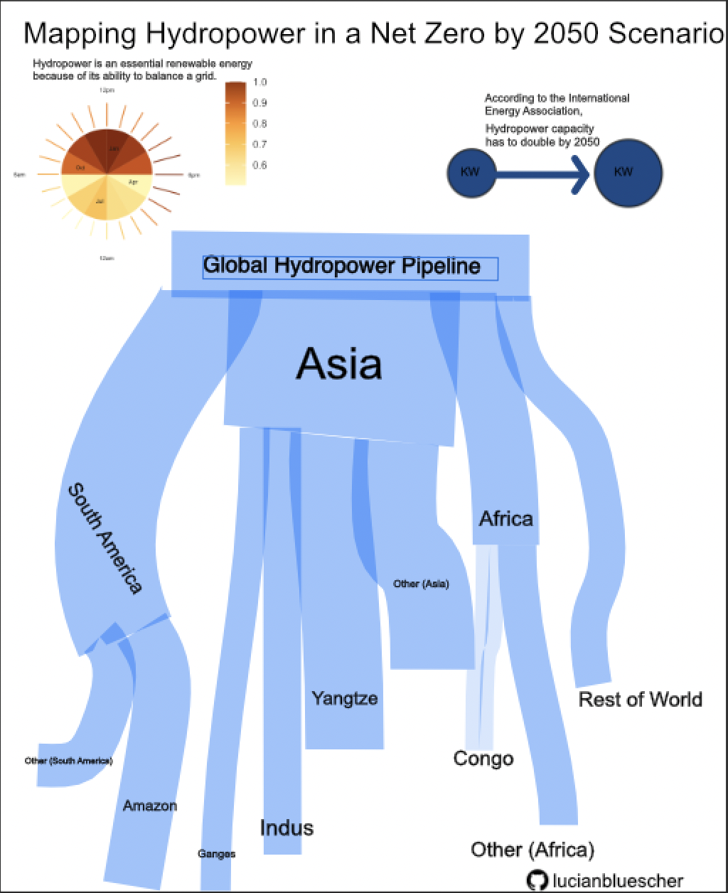

# **WORK IN PROGRESS (TO BE REVISED)**

```{r}
#| label: setup
#| echo: false
#| message: false
#| warning: false

library(tidyverse)
library(here)
```

{fig-alt="(Not so) Final Infographic"}

## Why I made this

Hydropower is the world’s largest renewable electricity source—but the push to expand it collides with a less-visible reality: **reservoirs emit greenhouse gases**, and those emissions vary wildly by location and design.

My goal with this infographic is to make one planning-focused message clear for a broad audience:

- **Hydropower can support net zero, but only if the buildout is steered toward lower-impact designs and locations.**

## Data (and what each source adds)

- **IEA Net Zero by 2050 (NZE)** (`data/NZE2021_AnnexA.csv`)
  - The “hydro must double by 2050” framing (capacity / generation targets).
- **Soued et al. (2022), *Nature Geoscience*** (`data/moesm.xlsx`)
  - Global reservoir area + emissions pathways (CO\(_2\), CH\(_4\)) and radiative forcing over time.
  - Key nuance: this is **all reservoirs globally**, not hydropower-only.
- **Li & He (2022), *Renewable and Sustainable Energy Reviews***
  - Summarized carbon intensity patterns (e.g., shallow + eutrophic reservoirs trend higher).
  - Used to compare against an **80 kg CO\(_2\)e/MWh** “low-carbon” target and show how many projects exceed it.
- **FHReD (Zarfl et al. 2015) future dams database**
  - `data/FHReD_2015_future_dams_Zarfl_et_al_beta_version/FHReD_2015_future_dams_Zarfl_et_al_beta_version.xlsx`
  - \(\sim\)3,700 future projects with capacity, basin, country/continent, stage, timing, and coordinates.
  - Used for “pipeline” visuals: where future capacity is concentrated (basins/regions/size).
- **OWID (Our World in Data)** (`data/hydropower-generation/`, `data/share-electricity-hydro/`)
  - Historical generation and share context for timeline-style panels.

## Progress snapshots (component visuals)

Below are two component visuals rendered directly in this post.

### Hydropower “sun” (seasonality × time of day)

```{r}
#| label: fig-hydro-sun
#| fig-cap: "Hydropower “sun”: months at the core, hours as corona (regional example). Brighter = more generation."
#| fig-alt: "Circular heatmap with months in the inner ring and hourly rays in the outer ring, colored from pale to dark orange to show higher hydropower generation."

library(haven)
library(lubridate)

dta <- read_dta(here::here("posts/hydro_infographic/data/marginal-generation-offsets-data.dta"))

inner_radius <- 1.5

inner_month <- dta %>%
  mutate(
    month_num = month(dt),
    month_lab = factor(month.abb[month_num], levels = month.abb)
  ) %>%
  group_by(month_lab) %>%
  summarise(h_mean = mean(h, na.rm = TRUE), .groups = "drop") %>%
  mutate(h_norm = h_mean / max(h_mean, na.rm = TRUE))

month_slots <- tibble(
  month_lab = factor(month.abb, levels = month.abb),
  x_center  = seq(1, 23, by = 2)
)

inner_month_long <- inner_month %>% inner_join(month_slots, by = "month_lab")

outer_hour <- dta %>%
  mutate(hour = hour(dt)) %>%
  group_by(hour) %>%
  summarise(h_mean = mean(h, na.rm = TRUE), .groups = "drop") %>%
  mutate(
    h_norm   = h_mean / max(h_mean, na.rm = TRUE),
    hour_rot = (hour - 12) %% 24,
    inner_r  = inner_radius + 0.1,
    outer_r  = inner_r + 0.9 * h_norm
  )

label_r <- inner_radius + 1.15
time_labels <- tibble(
  hour_rot = c(0, 6, 12, 18),
  label = c("12pm", "6pm", "12am", "6am"),
  hjust = c(0.5, -0.1, 0.5, 1.1),
  vjust = c(-0.5, 0.5, 1.2, 0.5)
)

month_labels <- tibble(
  x_center = c(1, 7, 13, 19),
  y_pos = inner_radius * 0.6,
  label = c("Jan", "Apr", "Jul", "Oct")
)

ggplot() +
  geom_col(
    data = inner_month_long,
    aes(x = x_center, y = inner_radius, fill = h_norm),
    width = 2,
    color = NA
  ) +
  geom_segment(
    data = outer_hour,
    aes(x = hour_rot, xend = hour_rot, y = inner_r, yend = outer_r, color = h_norm),
    lineend = "round",
    linewidth = 1.0,
    alpha = 0.9
  ) +
  geom_text(
    data = time_labels,
    aes(x = hour_rot, y = label_r, label = label),
    hjust = time_labels$hjust,
    vjust = time_labels$vjust,
    size = 2.8,
    color = "gray40"
  ) +
  geom_text(
    data = month_labels,
    aes(x = x_center, y = y_pos, label = label),
    size = 2.5,
    color = "gray50"
  ) +
  coord_polar(theta = "x", start = 0) +
  scale_colour_gradientn(
    colours = c("#fff7bc", "#fee391", "#fec44f", "#fe9929", "#d95f0e", "#993404"),
    name = "Avg hydropower\n(normalized)"
  ) +
  scale_fill_gradientn(
    colours = c("#fff7bc", "#fee391", "#fec44f", "#fe9929", "#d95f0e", "#993404"),
    guide = "none"
  ) +
  scale_y_continuous(limits = c(0, inner_radius + 1.3), breaks = NULL) +
  labs(
    title = NULL,
    subtitle = NULL,
    x = NULL,
    y = NULL
  ) +
  theme_minimal(base_size = 11) +
  theme(
    legend.position = "right",
    axis.text = element_blank(),
    axis.ticks = element_blank(),
    panel.grid.minor = element_blank(),
    panel.grid.major = element_blank()
  )
```

### Future hydropower “pipeline” (FHReD)

```{r}
#| label: fig-future-hydro-sankey
#| fig-cap: "Future hydropower pipeline (FHReD): global trunk → continents → major basins (top 3 per continent). Width = planned capacity (MW)."
#| fig-alt: "Sankey diagram showing a global hydropower pipeline branching to continents and then to major river basins, with flow widths proportional to megawatts."

library(readxl)
library(networkD3)
library(htmlwidgets)
library(htmltools)

future <- read_xlsx(
  here("posts/hydro_infographic/data/FHReD_2015_future_dams_Zarfl_et_al_beta_version/FHReD_2015_future_dams_Zarfl_et_al_beta_version.xlsx"),
  sheet = 2
)

continent_mw <- future %>%
  filter(!is.na(`Capacity (MW)`), !is.na(Continent)) %>%
  group_by(Continent) %>%
  summarise(mw = sum(`Capacity (MW)`, na.rm = TRUE), .groups = "drop") %>%
  arrange(desc(mw))

basin_mw <- future %>%
  filter(!is.na(`Capacity (MW)`), !is.na(`Major Basin`), !is.na(Continent)) %>%
  group_by(Continent, `Major Basin`) %>%
  summarise(mw = sum(`Capacity (MW)`, na.rm = TRUE), .groups = "drop")

top_basins_per_continent <- basin_mw %>%
  group_by(Continent) %>%
  slice_max(mw, n = 3) %>%
  pull(`Major Basin`)

basin_tab <- basin_mw %>%
  mutate(
    basin_group = if_else(
      `Major Basin` %in% top_basins_per_continent,
      `Major Basin`,
      paste0("Other (", Continent, ")")
    )
  ) %>%
  group_by(Continent, basin_group) %>%
  summarise(mw = sum(mw), .groups = "drop") %>%
  arrange(Continent, desc(mw))

trunk_node <- data.frame(name = "Global hydropower pipeline")
continent_nodes <- data.frame(name = continent_mw$Continent)
basin_nodes <- data.frame(name = unique(basin_tab$basin_group))

nodes <- bind_rows(trunk_node, continent_nodes, basin_nodes)
nodes$id <- seq_len(nrow(nodes)) - 1

get_id <- function(nm) nodes$id[nodes$name == nm]

links_tier1 <- continent_mw %>%
  mutate(
    source = get_id("Global hydropower pipeline"),
    target = purrr::map_int(Continent, get_id),
    value  = mw
  ) %>%
  select(source, target, value)

links_tier2 <- basin_tab %>%
  mutate(
    source = purrr::map_int(Continent, get_id),
    target = purrr::map_int(basin_group, get_id),
    value  = mw
  ) %>%
  select(source, target, value)

links <- bind_rows(links_tier1, links_tier2) %>%
  mutate(across(c(source, target), as.integer))

sn <- sankeyNetwork(
  Links       = as.data.frame(links),
  Nodes       = as.data.frame(nodes),
  Source      = "source",
  Target      = "target",
  Value       = "value",
  NodeID      = "name",
  units       = "MW",
  fontSize    = 12,
  nodeWidth   = 25,
  nodePadding = 15,
  sinksRight  = TRUE,
  width       = 900,
  height      = 600
)

sn <- htmlwidgets::onRender(sn, '
  function(el, x) {
    d3.select(el).selectAll(".node rect")
      .style("fill", "black")
      .style("stroke", "none");

    d3.select(el).selectAll(".node text")
      .style("font-family", "sans-serif")
      .style("font-size", "11px")
      .style("fill", "black");

    d3.select(el).selectAll(".link")
      .style("stroke", "#000")
      .style("stroke-opacity", 0.35);
  }
')

sn
```

Other key graphs to be included cover:

- **Hydro must double** (IEA NZE)
- **CO\(_2\) → CH\(_4\)** pathway shift + **decoupling** (Soued)
- **Carbon intensity risk patterns** + **share failing 80 kg target** (Li & He)
- **Future hydro pipeline** by basin/region (FHReD)
- A “river timeline” concept that stitches multiple threads into one narrative

## Design choices (10 elements)

::: panel-tabset

### Graphic form

I mix familiar forms (bubbles, stacked areas, dot/threshold comparisons) with more narrative shapes (the “river timeline”) to guide attention without overwhelming readers.

### Text

Short titles and direct annotations do most of the work. I’m aiming for “readable at poster distance,” with extra detail pushed into captions.

### Themes

Minimal themes throughout: few gridlines, intentional whitespace, and consistent margins so panels can be assembled cleanly in a layout tool.

### Colors

A consistent palette is defined in `final_graphics/style.md`. I keep most marks monochrome and use color as an accent when it adds meaning (not decoration).

### Typography

Simple, legible sans-serif choices; consistent hierarchy (title > subtitle > annotation > caption). I avoid dense paragraphs inside plots.

### General design

I’m prioritizing: **visual hierarchy**, alignment, and “data-ink” efficiency. Several panels also have “plain/minimal” variants intended as background textures.

### Contextualizing data

I will add just enough context to avoid misinterpretation

### Centering the primary message

The narrative is structured as:

- **Need** (NZE doubling) → **tradeoff** (reservoir emissions) → **variability** (CI differs by conditions) → **where** (future pipeline) → **so what** (planning lens).

### Accessibility

High-contrast designs, readable labels, and clear figure alt text. I also rewrote scientific notation (e.g., “Reservoir area (100,000 km\(^2\))”) to reduce jargon.

### DEI lens

Future dams intersect with people and places. I’m working to avoid “inevitable expansion” framing and instead emphasize **decision points** (siting, design, governance) and who bears impacts.

:::

## What this infographic argues

Hydropower can meaningfully contribute to net zero, but **where and how we build the next wave of dams** determines whether climate gains come with avoidable social and ecological costs.


